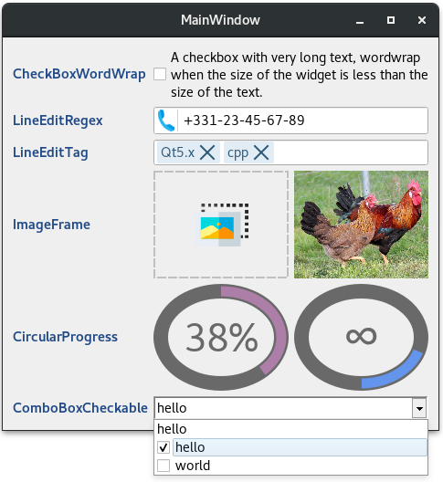
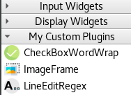
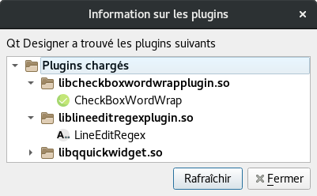

# qtCustomPlugins
[](https://travis-ci.org/thibDev/qtCustomPlugins)
[](https://opensource.org/licenses/MIT)  

A set of custom widgets to use directly in QtDesigner.

## Requirements

* qt5-default
* libqt5designer5
* qttools5-dev

## Plugins

* [CheckBoxWordWrap](./plugins/CheckBoxWordWrap)
* [LineEditRegex](./plugins/LineEditRegex)
* [LineEditTag](./plugins/LineEditTag)
* [ImageFrame](./plugins/ImageFrame)
* [CircularProgress](./plugins/CircularProgress)
* [ComboBoxCheckable](./plugins/ComboBoxCheckable)



### How to use
It's very easy, just drag & drop the widget in QtDesigner like with all others QtWidgets.



## Compile
### All plugins
```sh
cd plugins
mkdir build
cd build
qmake ../customPlugins.pro
make
```
### Individually
```sh
# Juste replace the last step by this line:
make sub-[YourWantedPlugin]
```

## Install
After the build step, take the `.so` file and copy it into the QtCreator directory.  
Ex. `cp liblineeditregexplugin.so ~/Qt/Tools/QtCreator/lib/Qt/plugins/designer/`  
If the plugins are correctly installed, they appear in menu `Tools/Form Editor/About Qt Designer plugins`



## Plugins icons

CheckBoxWordWrap, ImageFrame, ComboBoxCheckable and LineEditTag icon made by [Freepik](https://www.freepik.com/) from [Flaticon](www.flaticon.com)  
LineEditRegex icon made by [Alfredo creates](https://www.alfredocreates.com/) from [Flaticon](www.flaticon.com)  
CircularProgress icon made by [Smashicons](https://smashicons.com/) from [Flaticon](www.flaticon.com)
