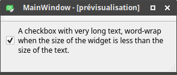
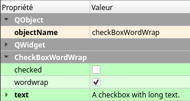

# qtCheckBoxWordWrapPlugin
[](https://travis-ci.org/thibDev/qtCheckBoxWordWrapPlugin)
[](https://opensource.org/licenses/MIT)  

A Qt plugin to use graphically QCheckbox with word wrap in QtDesigner

|<div style="text-align:center;">In program</div>|<div style="text-align:center;">In designer</div>|
|------|------|
|<div style="text-align:center"></div>|<div style="text-align:center"></div>|

## Requirements

* qt5-default
* libqt5designer5
* qttools5-dev

## Compile & install

```sh
mkdir build
cd build
qmake ../CheckBoxWordWrap.pro
make release
cp libcheckboxwordwrapplugin.so ~/Qt/Tools/QtCreator/lib/Qt/plugins/designer/
```
