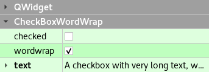

# CheckBoxWordWrap

## Properties

|Property|Type|
|-|-|
|checked|[bool](http://doc.qt.io/qt-5/qabstractbutton.html#checked-prop)|
|tristate|[bool](http://doc.qt.io/qt-5/qcheckbox.html#tristate-prop)|
|wordwrap|[bool](http://doc.qt.io/qt-5/qlabel.html#wordWrap-prop)|
|text|[QString](http://doc.qt.io/qt-5/qlabel.html#text-prop)|

