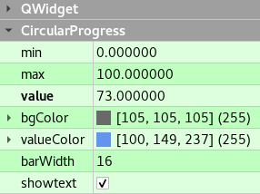

# CircularProgress

## Properties

|Property|Type|
|-|-|
|min|int|
|max|int|
|value|int|
|bgColor|[QColor](http://doc.qt.io/qt-5/qcolor.html)|
|valueColor|[QColor](http://doc.qt.io/qt-5/qcolor.html)|
|barWidth|int|
|showtext|bool|
|infinity|bool|
|startAngle|int [(1/360 = 1*16)](http://doc.qt.io/qt-5/qpainter.html#drawArc)|

